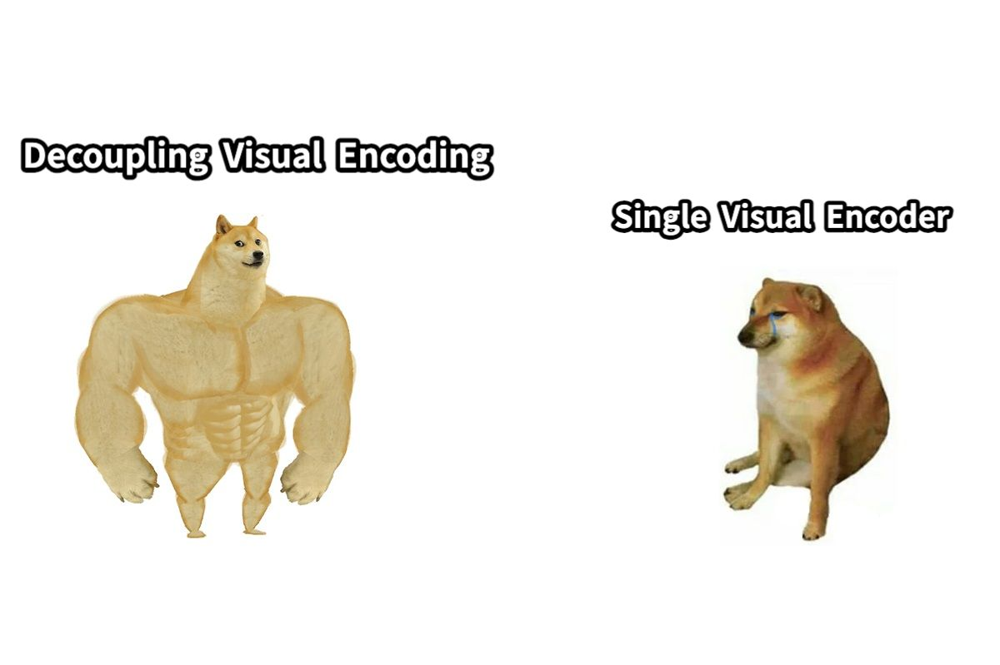

# cog-Janus-Pro-7B
Cog wrapper for deepseek-ai/Janus-Pro-7B

# deepseek-ai/Janus-Pro-7B Cog model

This is an implementation of [deepseek-ai/Janus-Pro-7B)](https://huggingface.co/deepseek-ai/Janus-Pro-7B) as a Cog model. [Cog packages machine learning models as standard containers.](https://github.com/replicate/cog)

Run a prediction:

    cog predict -i image=@doge.png -i question="Convert the formula into latex code"

## Output:

    This image is a humorous meme comparing two concepts: "Decoupling Visual Encoding" and "Single Visual Encoder."

    1. **Left Side: Decoupling Visual Encoding**
    - The image shows a muscular, strong-looking dog, representing a robust and powerful concept.
    - This symbolizes "Decoupling Visual Encoding," which implies a more efficient or effective way of encoding visual information. The muscular dog suggests strength, efficiency, and robustness in handling visual data.

    2. **Right Side: Single Visual Encoder**
    - The image shows a smaller, less muscular dog, looking tired or less confident.
    - This represents "Single Visual Encoder," which suggests a simpler or less powerful approach to encoding visual information. The smaller dog implies that this method might not be as effective or robust as the decoupled approach.

    ### Overall Meaning:
    The meme humorously contrasts two concepts in the field of computer vision or machine learning, where "Decoupling Visual Encoding" is depicted as a more powerful and efficient method, while "Single Visual Encoder" is portrayed as less effective or less robust. The use of the Doge meme characters adds a layer of humor and relatability to the comparison.